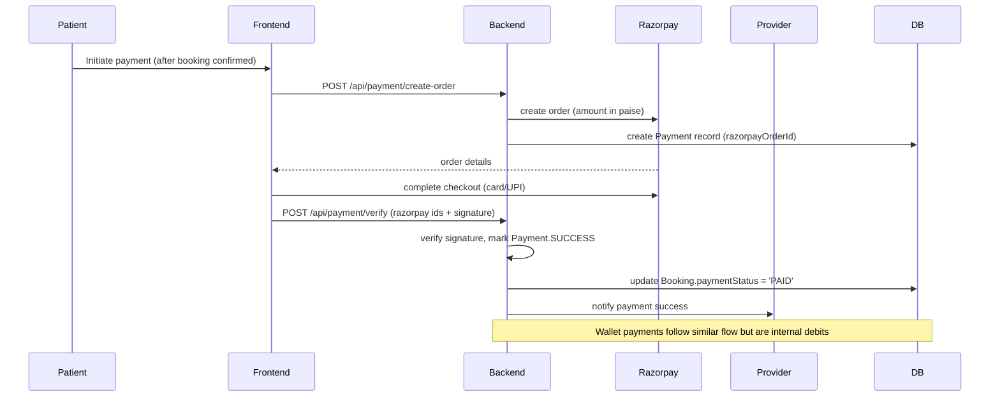

# Payment Flow Diagram (Mermaid)

```mermaid
sequenceDiagram
  participant Patient
  participant Frontend
  participant Backend
  participant Razorpay
  participant Provider

  Patient->>Frontend: Initiate payment (after booking confirmed)
  Frontend->>Backend: POST /api/payment/create-order
  Backend->>Razorpay: create order (amount in paise)
  Backend->>DB: create Payment record (razorpayOrderId)
  Razorpay-->>Frontend: order details
  Frontend->>Razorpay: complete checkout (card/UPI)
  Frontend->>Backend: POST /api/payment/verify (razorpay ids + signature)
  Backend->>Backend: verify signature, mark Payment.SUCCESS
  Backend->>DB: update Booking.paymentStatus = 'PAID'
  Backend->>Provider: notify payment success
  Note over Backend,DB: Wallet payments follow similar flow but are internal debits
```

Files: [backend/src/controllers/paymentController.js](backend/src/controllers/paymentController.js#L1-L400)
